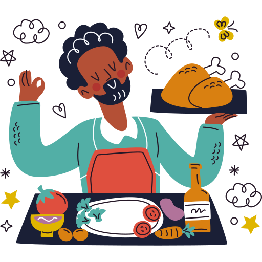

<!DOCTYPE html>
<html lang="en">
<head>
    <link rel="icon" href="./img/favicon.png" type="image/png">
    <link rel="stylesheet" href="./css/style.css"/>
    <link rel="stylesheet" href="./css/index.css"/>
    <title>Sai restuarant</title>
    
</head>
<body>

    

    
    
    
    
    

    <h1 class="page-heading">
    Welcome to sai resturant
    </h1>
    

        Good food,good moodFood is our love language.Eat well,live well. 
        lifes to short to eat bad food.
        

    

        <a href="./pages/menus.html">
        <button class="btn btn-primary">Explore Menus</button>
    </a>

    <a href="./pages/contact.html">
        <button class="btn btn-secondary">Contact Us</button>
        
        </a>
    

</body>
</html>
